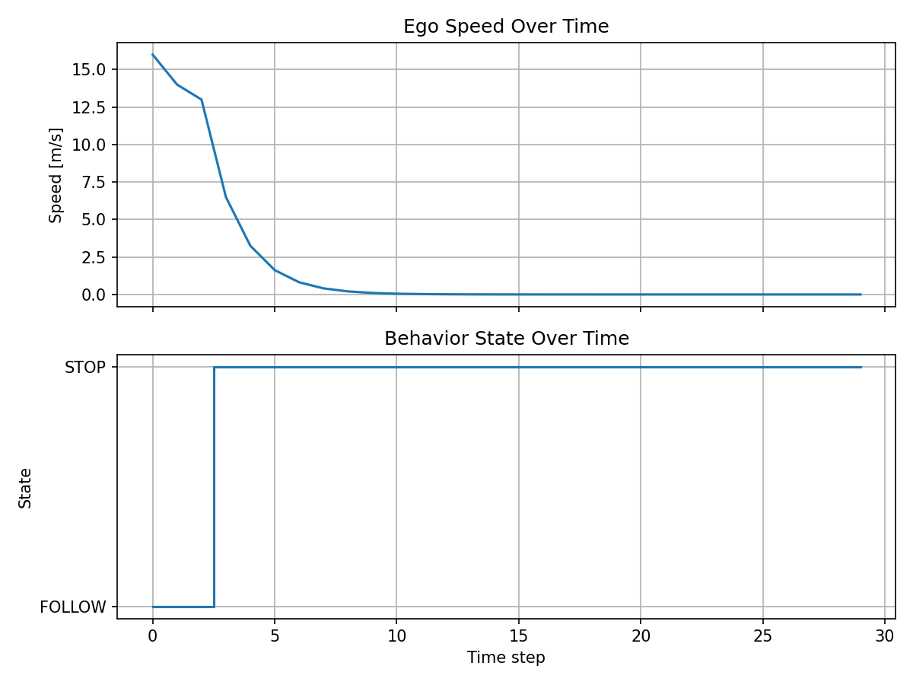
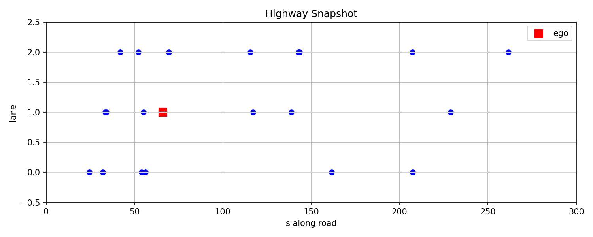

# Highway Lane-Change Behavior Planning (FSM)

This project implements an advanced **highway behavior planner** for an ego vehicle using a **Finite State Machine (FSM)** with cost‑based transitions and a simple multi‑lane highway world.

The code is split into a reusable Python package under `src/` plus a teaching notebook under `notebooks/`. The `docs/` folder contains generated figures.

---

## Repository structure

```text
HIGHWAY-LANE-CHANGE-BEHAVIOR-PLANNER-FSM
├── app/                   # (optional) app/entrypoint code
├── data/                  # input data, logs, scenario files (currently empty)
├── docs/                  # top-level documentation (you can move PNGs here)
├── notebooks/
│   └── docs/
│       ├── behavior_over_time.png
│       ├── highway_snapshot.png
│       └── Projekt_2_Behavior_Planning_FSM.ipynb
├── scripts/
│   └── demo.py            # example script using the library
├── src/
│   ├── __init__.py        # package init
│   ├── behavior_sm.py     # FSM + cost-based behavior planner
│   ├── highway_world.py   # highway & vehicle model
│   ├── simulation.py      # simulation loop and history handling
│   ├── states.py          # state definitions, base transition costs
│   └── visualization.py   # plotting utilities
├── tests/                 # unit / regression tests
├── venv/                  # local virtualenv (not for git)
├── README.md
└── requirements.txt
```

## Project overview

This project implements a highway lane-change behavior planner using a cost-based Finite State Machine (FSM). 

An ego vehicle drives on a three-lane highway with randomly placed vehicles and selects behaviors based on transition costs and traffic-dependent penalties such as, 
```bash
 {
    CRUISE, 
    FOLLOW, 
    STOP, 
    LANE_CHANGE_LEFT,
    LANE_CHANGE_RIGHT,
    ACCELERATE
}
``` 

## Key features

- Cost-based FSM with explicit transition costs between behavior states. 
- Simple 3-lane highway world with ego and randomly placed surrounding vehicles. 
- Perception logic that computes distances to nearest vehicles in same and adjacent lanes.
- Behavior selection using base transition costs plus traffic penalties (safety, lane availability, inertia). 
- Modular Python design (`states`, `highway_world`, `behavior_sm`, `simulation`, `visualization`).
- CLI demo that runs the simulation and saves plots into `docs/`. 

## Code structure

- `notebooks/Projekt_2_Behavior_Planning_FSM.ipynb` – teaching/demo notebook for the FSM planner.
- `src/states.py` – FSM state set and base transition-cost table. 
- `src/highway_world.py` – `Vehicle` model, highway creation, and distance computation. 
- `src/behavior_sm.py` – generic `SM` class, traffic penalty, and `BehaviorSM` implementation. 
- `src/simulation.py` – `run_simulation()` loop for the ego vehicle. 
- `src/visualization.py` – functions to save highway snapshot and behavior-over-time plots to `docs/`.
- `scripts/demo.py` – command-line entry point to run the planner.

### Results:

**Behavior state over time**



**Highway Snapshot(Simulated)**



**Finite State Machines Graph**


---


## How to run 

### **A**

You can run the FSM simulation and visualize the results from a Python session:

```python
from src.simulation import run_simulation
from src.visualization import plot_highway_snapshot, plot_behavior_over_time

vehicles, history = run_simulation(steps=30)

# Ego is the first vehicle in the list
ego = next(v for v in vehicles if v.is_ego)

plot_highway_snapshot(vehicles, ego)
plot_behavior_over_time(history)
```

### **B**

Create and activate a virtual environment, then install dependencies:

```bash
python3 -m venv venv
source venv/bin/activate
pip install matplotlib
Run the demo:
```

```bash
python3 -m scripts.demo
```

This will run a 30-step simulation and save plots to docs/highway_snapshot.png and docs/behavior_over_time.png.

---

